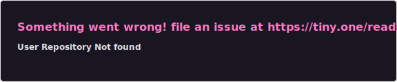
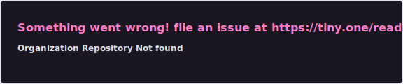

### Tobey is a Software Developer specialising in Games, Features, Tools UI & Web

  
  

- 😻 Passionate about game development & engaging user experiences
- 🚀 Over 2.5 million unique downloads on
  [Nexus Mods](https://next.nexusmods.com/profile/toebeann/mods)!
- ⛑️ Maintains BepInEx packs, guides and installation tools for multiple games
  across multiple operating systems
- 🤼 Collaborated on popular Unity modding projects with
  <a href="https://github.com/SubnauticaModding" target="_blank">@SubnauticaModding</a>
- 🏳️‍🌈 Pronouns: he/they
- 💬 Ask me about API development, bun, Node.js, C# reflection, Unity modding
- 💌 Reach me on Twitter:
  <a href="https://twitter.com/toebean__" target="_blank">@toebean__</a>

#### Popular repositories and contributions

  
  

  
  

  
  

  

